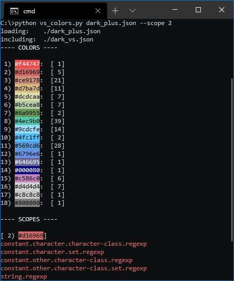

# vscode\_find\_colors
Read VS Code theme colors and output them in a terminal. Designed for creating language grammar extensions, where color coordination is important.

## Usage

```
usage: vs_colors.py [-h] [-c JSONFILE] [-s COLOR|NUM [COLOR|NUM ...]] [-S]
                    [-l] [-q] [-I]
                    JSONFILE

positional arguments:
  JSONFILE              json file to parse

optional arguments:
  -h, --help            show this help message and exit
  -c, --compare JSONFILE compare colors with input file
  -s, --scopes COLOR|NUM [...]
                        list the scopes using a specified color
  -S, --all-scopes      list all scopes for every color
  -l, --list            list all colors (default behavior)
  -q, --quiet           reduce console output to only requested info
  -I, --no-includes     don't follow include directives
```

## Preview

<p align="center"></p>
